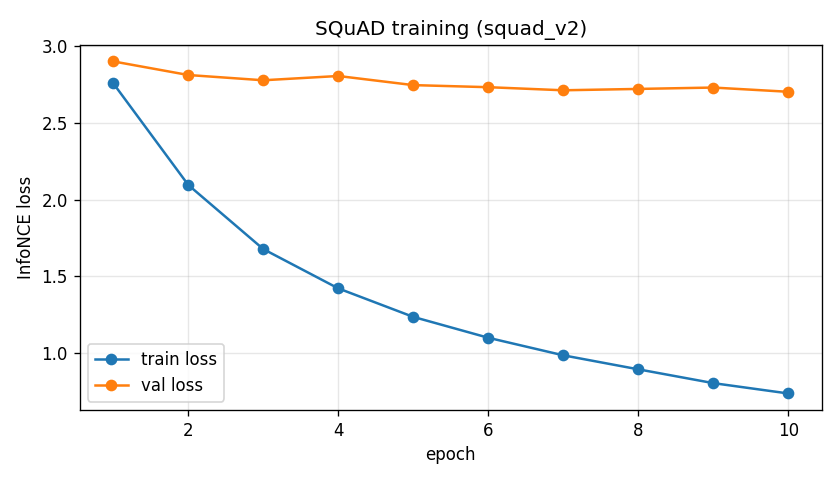
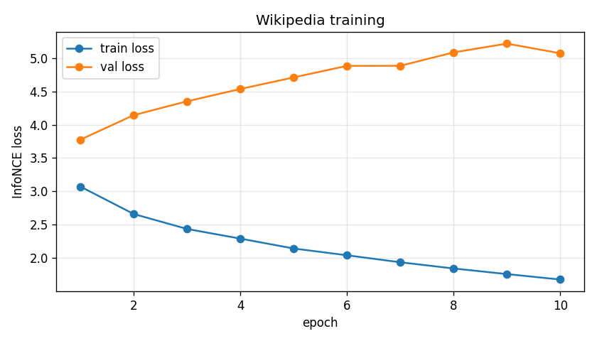

# Neural Search Engine - რეპორტი

## 1. მოკლე აღწერა

ჩვენი პროექტი არის პატარა neural search engine. იდეა მარტივია: მომხმარებელი წერს query-ს,
ჩვენ ამ query-ს გადავცემთ ჩვენს encoder მოდელს, ვიღებთ embedding-ს, შემდეგ vector search-ით
ვპოულობთ ყველაზე მსგავს ტექსტურ მონაკვეთებს.

```
query → encoder → query embedding → vector search → top-k chunks
```

რამდენიმე მნიშვნელოვანი არჩევანი, რომელიც თავიდანვე გავაკეთეთ:

- **encoder-ს scratch-იდან ვწვრთნით.** pretrained ენის მოდელს (BERT და მსგავსი) წონებს არ ვიყენებთ -
  მოდელის წონები random-ად ინიციალდება და მთლიანად ჩვენს მონაცემებზე სწავლობს.
- **sentence-transformers ბიბლიოთეკა არ გამოგვიყენებია** contrastive learning
  თვითონ დავაიმპლემენტირეთ (InfoNCE loss).
- baseline-ად **BM25** ავიღეთ და ჩვენს მოდელს სწორედ მას ვადარებთ.

ერთ რამეს თავიდანვე ვამბობთ: მთავარი მიზანი არ იყო საუკეთესო performance. მიზანი იყო, რომ სწორად
გაგვეგო ამოცანა, ტექნიკური არჩევანი დაგვესაბუთებინა და შედეგი გულახდილად გაგვეანალიზებინა. როგორც
ქვემოთ ჩანს, ჩვენი scratch მოდელი BM25-ს წააგებს - და ეს მოსალოდნელი იყო.

---

## 2. Pipeline

```
[1] preprocess   →  jsonl ფაილები (train/val/test) + J&M demo corpus
[2] analyze      →  data quality შემოწმება (stats.json)
[3] train + eval →  მოდელის წვრთნა, ევალუაცია, demo
```

`analyze` ცალკე ნაბიჯად დავტოვეთ preprocess-ის შემდეგ, რადგან quality მეტრიკებს (dup rate, length,
leakage) მხოლოდ უკვე დამუშავებულ წყვილებზე აქვს აზრი. თუ preprocess-ს თავიდან გავუშვებთ, analyze-იც
თავიდან უნდა გავუშვათ.

---

## 3. მონაცემები

### 3.1 რა მონაცემები ავირჩიეთ

თრეინინგისთვის ორი dataset ავირჩიეთ, ორივე საჯაროდ ხელმისაწვდომი:

**SQuAD v1.1** (`rajpurkar/squad`)
- query = კითხვა (ბუნებრივი ენის შეკითხვა, საშუალოდ ~10 სიტყვა)
- document = პარაგრაფი, რომელშიც პასუხია
- ეს ზუსტად ჩვენი ამოცანის ტიპია: კითხვა → შესაბამისი ტექსტის მონაკვეთი
- v2-ის ნაცვლად v1.1 ავირჩიეთ, რადგან v2-ში ბევრი unanswerable კითხვაა და ის ჩვენს positive-pair
  ლოგიკას არ ერგება

**Wikipedia Simple English** (`wikimedia/wikipedia`, `20231101.simple`)
- query = სტატიის სათაური (title)
- document = სტატიის პარაგრაფი
- ცალკე მოდელი გავწვრთენით ამ მონაცემებზე, რომ
  გვენახა, განსხვავდება თუ არა შედეგი SQuAD-ისგან

**Jurafsky & Martin წიგნი** (demo corpus)
- ეს თრეინინგში არ მონაწილეობს. ეს არის მხოლოდ ის ტექსტი, რომელშიც demo-ს დროს ვეძებთ
- მთელი წიგნი ავიღეთ (Speech and Language Processing, SLP3 draft, Jan 6 2026) - სრული PDF
  გადმოვწერეთ, `pdftotext`-ით ტექსტად ვაქციეთ და 200-300 სიტყვიან chunk-ებად დავჭერით
- წიგნის ბოლოს არის დიდი index და თითო თავის შემდეგ bibliography. ეს chunk-ები მხოლოდ წლებითა და
  გვერდის ნომრებითაა სავსე და ძიებაში არაფერს აძლევს, ამიტომ ისინი ამოვაგდეთ. დარჩა **718 chunk**

### 3.2 query და document

ყველა dataset-ში ფორმატი ერთნაირია - თითო ხაზი ერთი positive წყვილია (jsonl):

```json
{"query": "...", "document": "...", "doc_id": "...", "source": "squad", "split": "train"}
```

- **query** - ის, რასაც მომხმარებელი წერდა (კითხვა ან სათაური)
- **document** - სწორი ტექსტური მონაკვეთი, რომელიც ამ query-ს შეესაბამება

### 3.3 cleaning და filtering

- ზედმეტი space-ები მოვაშორეთ
- ცარიელი query/document ამოვაგდეთ
- ტექსტი lowercase-ში გადავიყვანეთ
- ძალიან მოკლე document-ები (<40 სიტყვა) ამოვაგდეთ - პატარა chunk-ი retrieval-ში სუსტია
- ძალიან გრძელი (>300 სიტყვა) მოვჭერით
- ერთიდაიგივე წყვილი ერთხელ დავტოვეთ (დუბლიკატები არაფერს მატებს)

რაც **არ** გავაკეთეთ: stemming, stopword removal, feature selection. encoder representation-ს
end-to-end სწავლობს, ამიტომ ეს ნაბიჯები საჭირო არ იყო.


### 3.4 train / val / test split

split **row-level random არ არის** - **group-level** არის (80/10/10).

რატომ: SQuAD-ში ერთ პარაგრაფს ხშირად 5-6 კითხვა ერთვის. თუ random split გავაკეთებდით, იგივე
პარაგრაფი მოხვდებოდა train-შიც და test-შიც, და მოდელი test-ზე "უკვე ნანახ" ტექსტს შეაფასებდა -
ეს არის leakage და ხელოვნურად ზრდის მეტრიკებს. ამიტომ ჯერ პარაგრაფებს (Wiki-ში - სტატიებს)
ვაჯგუფებთ და მერე ჯგუფებს ვყოფთ split-ებად. ასე ერთი document მხოლოდ ერთ split-შია.

`analyze.py` ამოწმებს train/test document overlap-ს. ორივე dataset-ზე **overlap = 0**.

split-ის ზომები (seed=42, reproducible):

| dataset | train | val | test |
|---------|-------|-----|------|
| SQuAD | 68,536 | 9,155 | 7,880 |
| Wikipedia | 38,070 | 4,542 | 5,136 |

J&M demo corpus: **718 chunk** (მთელი წიგნი), თითო 200-300 სიტყვა.

### 3.5 data quality ანალიზი

`analyze.py` ითვლის რამდენიმე მეტრიკას და გვეხმარება გავიგოთ, რა გვაქვს ხელში:

| | SQuAD (train) | Wikipedia (train) |
|--|---------------|-------------------|
| pairs | 68,536 | 38,070 |
| query საშ. სიგრძე | 10.0 სიტყვა | 1.8 სიტყვა |
| dup_query_rate | 0.00 | 0.77 |
| dup_doc_rate | 0.79 | 0.00 |
| train/test overlap | 0 | 0 |

რას გვეუბნება ეს:

- **SQuAD**-ში query-ები მრავალფეროვანი და გრძელია (კარგია), მაგრამ ერთი document რამდენიმე
  კითხვას ემსახურება (`dup_doc_rate` 0.79).
- **Wikipedia**-ში document-ები unique-ია, მაგრამ query (სათაური) ძალიან მოკლეა (1.8 სიტყვა) და
  ხშირად მეორდება (`dup_query_rate` 0.77).

ეს ორი მახასიათებელი InfoNCE-სთვის მნიშვნელოვანია, რადგან ჩვენ batch-ში არსებულ სხვა დოკუმენტებს
ნეგატივად ვიყენებთ. თუ ერთ batch-ში ერთიდაიგივე დოკუმენტი ორი სხვადასხვა query-ს დადებითად
უკავშირდება, მოდელმა შეიძლება ერთი მათგანი მცდარად ნეგატივად ჩათვალოს (false negative). ეს
SQuAD-ის სტრუქტურის თვისებაა, არა ბაგი - და ამიტომაც ვამოწმებთ წინასწარ.

**დასკვნა მონაცემებზე:** ძირითად მოდელად SQuAD ავირჩიეთ, რადგან query-ის ხარისხი მაღალია და
"კითხვა → პასუხის პარაგრაფი" პირდაპირ ჩვენი search ამოცანაა.

---

## 4. Baseline - BM25

baseline-ად **BM25** ავიღეთ (`rank_bm25` ბიბლიოთეკით). ის კლასიკური keyword-based retrieval
მეთოდია - ითვლის query-სა და document-ში სიტყვების დამთხვევას (term frequency + იშვიათი
სიტყვების წონა), ყოველგვარი წვრთნის გარეშე.

რატომ BM25:
- მარტივია და ცნობილია როგორც ძლიერი baseline retrieval-ში
- წვრთნა არ სჭირდება, ამიტომ კარგი "სამართლიანი" შესადარებელია ჩვენი მოდელისთვის
- თუ ჩვენი ნასწავლი მოდელი BM25-ს ვერ აჯობებს, ეს თავისთავად საინტერესო და გასაანალიზებელი შედეგია

BM25-ს ზუსტად იგივე index-ზე და იგივე test query-ებზე ვუშვებთ, რაც ჩვენს მოდელს - რომ შედარება
სამართლიანი იყოს.

---

## 5. მოდელის არქიტექტურა

encoder არის პატარა **Transformer**, scratch-იდან:

1. token embedding (random init) + learned positional embedding
2. Transformer encoder (padding mask-ით)
3. mean pooling არა-padding token-ებზე
4. linear projection საბოლოო embedding-ზე
5. L2 normalize - რომ embedding-ები dot product-ით (cosine) შევადაროთ

ერთი და იგივე encoder ვამუშავებთ query-ზეც და დოკუმეენტზეც.

საბოლოო (ძირითადი) მოდელის ჰიპერპარამეტრები:

| პარამეტრი | მნიშვნელობა |
|-----------|-------------|
| vocab size | 30522 (bert-base-uncased tokenizer) |
| embedding dim | 256 |
| attention heads | 4 |
| layers | 2 |
| feed-forward dim | 512 |
| max length | 128 token |
| projection (output emb) | 128 |
| dropout | 0.3 |
| პარამეტრების რაოდენობა | 8,933,504 |

**რატომ ეს არქიტექტურა:** თავიდან უფრო დიდი მოდელი ვცადეთ (embedding 512, 8 head, 3 layer,
~22M პარამეტრი). ის ძალიან სწრაფად overfit-და - train loss ხდებოდა, val loss კი არ მცირდებოდა.
რადგან მონაცემები scratch მოდელისთვის შედარებით ცოტაა და overfitting პრობლემა იყო, **შევამცირეთ
მოდელი** (256/4/2) და dropout 0.3-მდე ავწიეთ. პატარა მოდელი უკეთ განზოგადდა, ამიტომ ეს დავტოვეთ
ძირითად მოდელად.

Transformer ავირჩიეთ BiLSTM-ის ნაცვლად, რადგან attention-ს უკეთ შეუძლია query-ში მნიშვნელოვან
სიტყვებზე ფოკუსირება, და ბევრად მარტივი დასაწერია PyTorch-ის მზა `nn.TransformerEncoder`-ით.

---

## 6. Contrastive learning - InfoNCE

loss ფუნქციად **InfoNCE** ავირჩიეთ.

იდეა: batch-ში გვაქვს N წყვილი (query, document). თითო query-სთვის მისი დაწყვილებული document
არის **positive**, ხოლო იმავე batch-ში დანარჩენი document-ები - **negative** (in-batch negatives).
ვითვლით query-სა და ყველა document-ს შორის similarity-ს, ვამრავლებთ temperature-ზე (0.05) და
ვაკეთებთ cross-entropy-ს დიაგონალური (სწორი) წყვილების მიმართ. ასე ვამთხვევთ სწორ query/document
წყვილებს და ვაცილებთ არასწორებს.

```python
def infonce_loss(query_emb, doc_emb, temperature=0.05):
    logits = query_emb @ doc_emb.T / temperature
    labels = torch.arange(len(query_emb), device=query_emb.device)
    return F.cross_entropy(logits, labels)
```

**რატომ InfoNCE და არა Triplet/Contrastive loss:**
- InfoNCE batch-ში ერთდროულად ბევრ negative-ს იყენებს, ამიტომ triplet loss-ზე ეფექტურია და
  სწრაფად სწავლობს
- triplet/contrastive loss-ს ცალკე hard negative-ების შერჩევა სჭირდება, ჩვენ კი მონაცემებში
  მზა negative წყვილები არ გვაქვს - InfoNCE-ს ეს არ სჭირდება, batch-ი თვითონ აძლევს negative-ებს
- ჩვენი (query, document) მონაცემები ზუსტად positive წყვილების ფორმატშია, რაც InfoNCE-ს იდეალურად ერგება

---

## 7. ტრენინგი

### 7.1 setup

- optimizer: AdamW
- learning rate: 3e-4 (SQuAD)
- batch size: 32
- epochs: 10
- temperature: 0.05
- loss: InfoNCE
- ლოგირება: TensorBoard (`logs/squad_v2/`, `logs/wiki/`) - train loss step-ზე და epoch-ზე, val loss epoch-ზე
- საუკეთესო checkpoint ვინახავთ ყველაზე დაბალი validation loss-ის მიხედვით

ქვემოთ მოცემული გრაფები და ცხრილები ამ TensorBoard log-ებიდანაა (`tensorboard --logdir logs/squad_v2`).

### 7.2 SQuAD model - შედეგი

| epoch | train loss | val loss |
|-------|-----------|----------|
| 1 | 2.7591 | 2.9022 |
| 2 | 2.0957 | 2.8134 |
| 3 | 1.6771 | 2.7790 |
| 4 | 1.4206 | 2.8069 |
| 5 | 1.2345 | 2.7474 |
| 6 | 1.0983 | 2.7339 |
| 7 | 0.9838 | 2.7137 |
| 8 | 0.8924 | 2.7225 |
| 9 | 0.8023 | 2.7315 |
| 10 | 0.7348 | **2.7040** |



გრაფზე ჩანს: train loss (ლურჯი) სწრაფად ეცემა, val loss (ნარინჯისფერი) კი თითქმის ჰორიზონტალურია
~2.7-ზე. ეს **overfitting-ის** ნათელი მაგალითია - მოდელი train მონაცემებს კარგად სწავლობს, მაგრამ
ახალ მონაცემებზე ვერ განზოგადებს. საუკეთესო val loss (2.7040) მე-10 epoch-ზე იყო, ეს checkpoint
(`checkpoints/squad_v2/best_model.pt`) დავტოვეთ.

### 7.3 Wikipedia model

იგივე არქიტექტურით ცალკე მოდელი დავატრეინინგეთ Wiki-ზე (lr 1e-4-მდე დავწიეთ, რადგან query-ები მოკლე და
ბუნდოვანია).

| epoch | train loss | val loss |
|-------|-----------|----------|
| 1 | 3.0719 | 3.7758 |
| 2 | 2.6611 | 4.1432 |
| 3 | 2.4369 | 4.3505 |
| 4 | 2.2922 | 4.5351 |
| 5 | 2.1439 | 4.7087 |
| 6 | 2.0424 | 4.8819 |
| 7 | 1.9374 | 4.8831 |
| 8 | 1.8443 | 5.0834 |
| 9 | 1.7605 | 5.2154 |
| 10 | 1.6788 | 5.0706 |



აქ სულ სხვა სურათია: train loss იცემა, მაგრამ val loss **იზრდება** (3.78 → 5.07). ანუ მოდელი
train-ს იზეპირებს, მაგრამ generalization უარესდება. მიზეზი ისაა, რომ Wiki query (1-2 სიტყვიანი
სათაური) contrastive ამოცანისთვის ძალიან სუსტი სიგნალია. ამიტომ Wiki მოდელი საბოლოო ევალუაციასა და
demo-ში **არ გამოვიყენეთ** - შედეგებს მხოლოდ SQuAD მოდელზე ვაჩვენებთ.

---

## 8. ევალუაცია

### 8.1 eval set და მეტრიკები

ევალუაცია SQuAD test split-ზე გავაკეთეთ. index-ში **unique document-ები** ჩავსვით (1721 ცალი),
არა 7880 დუბლირებული row - თორემ იგივე პარაგრაფი ბევრჯერ იქნებოდა index-ში. შემდეგ თითო test
query-სთვის ვითვლით embedding-ს და cosine similarity-ით ვალაგებთ დოკუმენტეებს.

მეტრიკები:
- **Recall@1** - სწორი document პირველ ადგილზე მოხვდა თუ არა
- **Recall@5** - სწორი document პირველ 5-ში მოხვდა თუ არა
- **MRR@5** - სწორი document-ის reciprocal rank (top-5-ში)

ეს მეტრიკები ავირჩიეთ, რადგან retrieval-ში ყველაზე მნიშვნელოვანია სწორი პასუხი რანჟირების
თავში მოხვდეს. Recall@1 აჩვენებს "ზუსტ მოხვედრას", Recall@5 - "სასარგებლო top-k-ში მოხვედრას",
MRR კი თვითონ პოზიციას აფასებს.

### 8.2 შედეგები

| მეთოდი | Recall@1 | Recall@5 | MRR@5 |
|--------|----------|----------|-------|
| BM25 (baseline) | **0.623** | **0.791** | **0.689** |
| ჩვენი მოდელი (SQuAD) | 0.244 | 0.448 | 0.320 |

### 8.3 ანალიზი

BM25 ჩვენს მოდელს მკაფიოდ **ჯობს** ყველა მეტრიკაში. ეს იმედგაცრუებად შეიძლება მოგვეჩვენოს,
მაგრამ სრულიად მოსალოდნელი იყო და რამდენიმე ნათელ მიზეზს აქვს:

1. **scratch მოდელი + ცოტა მონაცემები.** BM25-ს წვრთნა არ სჭირდება, ჩვენმა მოდელმა კი ნულიდან უნდა
   ისწავლოს ენა ~68k წყვილზე - ეს ცოტაა იმისთვის, რომ Transformer-მა კარგი representation ისწავლოს.
2. **overfitting** (იხ. training loss curve) - მოდელი train-ს იზეპირებს, ვერ განზოგადებს.
3. **SQuAD-ში პასუხი ხშირად query-ის სიტყვებს შეიცავს** - ეს keyword overlap-ს ეხმარება, ანუ
   BM25-ისთვის "ადვილი" dataset-ია.

მნიშვნელოვანია: მოდელი მაინც **სწავლობს რაღაცას** - Recall@5 0.448 ნიშნავს, რომ თითქმის ნახევარ
შემთხვევაში სწორი document top-5-შია. ანუ embedding-ები რეალურ სემანტიკურ სიგნალს იჭერენ, უბრალოდ
BM25-ის სიზუსტეს ვერ აღწევენ.

---

## 9. Demo

demo (`demo.py`) Jurafsky & Martin წიგნის corpus-ზე (718 chunk, მთელი წიგნი) მუშაობს. მომხმარებელი
წერს query-ს, მოდელი ითვლის მის embedding-ს, ადარებს ყველა chunk-ს და აბრუნებს top-k-ს.

ერთი დეტალი chunk-ების encode-ზე: chunk 200-300 სიტყვაა, ეს 128 token-ზე მეტია. ამიტომ თუ უბრალოდ
მოვჭრიდით, chunk-ის ნახევარი დაიკარგებოდა. ამის ნაცვლად თითო chunk-ს 128-token-იან window-ებად
ვჭრით, თითოს ცალკე encode-ს ვუკეთებთ და embedding-ებს ვაშუალებთ - ასე მთელი chunk მონაწილეობს.
doc embedding-ებს ერთხელ ვითვლით და ვქეშავთ (`data/processed/corpus_emb_*.npy`), რომ ყოველ გაშვებაზე
თავიდან არ დაითვალოს.

demo სამი ნასწავლი მოდელიდან ნებისმიერით გაეშვება (`--model`):

- **`squad_v2`** (default) - ჩვენი ძირითადი პატარა SQuAD მოდელი (256/4/2). ამაზეა აგებული შედეგები
- **`wiki`** - Wikipedia-ზე ნასწავლი მოდელი (იგივე არქიტექტურა, ის რომელიც overfit-და)
- **`squad`** - დიდი პირველი ვერსია (512/8/3), რომელიც სწრაფად overfit-და. შესადარებლად დავტოვეთ

გაშვება:

```bash
python demo.py                                          # interactive, default squad_v2
python demo.py --query "what is tokenization?"          # ერთი query
python demo.py --query "n-gram models" --k 3            # top-3 (default top-5)
python demo.py --model wiki                              # wiki checkpoint
python demo.py --model squad                             # დიდი squad checkpoint
```

რამდენიმე რეალური მაგალითი (default `squad_v2` მოდელი, top-3):

**query: "what are neural networks"** - კარგი შემთხვევა, სამივე შედეგი თემაშია და #1 ზუსტად სწორია:
1. neural networks თავის შესავალი (mcculloch-pitts neuron) - სწორი
2. neural units summary
3. recurrent neural networks

**query: "what is part of speech tagging"** - სწორი განმარტება #2-ზე მოხვდა, #1 კი NER-ია (ახლო
თემა, იგივე თავი):
1. named entity recognition / bio tagging
2. "part-of-speech tagging is the process of assigning a part-of-speech to each word..." - სწორი
3. POS/NER თავის summary

**query: "what is a transformer"** - ცუდი შემთხვევა, მოდელი ვერ მიხვდა: #1 speech spectral
features, #2 neural unit, #3 CNN. transformer-ის chunk top-3-ში არ მოხვდა.

**დასკვნა demo-ზე:** მაგალითები ზუსტად ემთხვევა ჩვენს მეტრიკებს (Recall@1 ≈ 0.24, Recall@5 ≈ 0.45).
მოდელი ხშირად პოულობს სწორ თემას და სწორი chunk ხშირად top-k-შია, მაგრამ ყოველთვის ზუსტად პირველ
ადგილზე ვერ აყენებს, ზოგ ბუნდოვან query-ზე კი საერთოდ ცდება. ეს scratch მოდელისა და ცოტა
მონაცემისთვის მოსალოდნელია და BM25-თან შედარების შედეგსაც ეთანხმება.

---

## 10. დასკვნა

- ავაგეთ სრული neural search pipeline: data → encoder (scratch) → InfoNCE წვრთნა → vector search → demo.
- contrastive learning (InfoNCE) თვითონ დავაიმპლემენტირეთ, sentence-transformers-ის გარეშე.
- ჩვენი მოდელი BM25-ზე უარესია (Recall@1 0.24 vs 0.62). ეს მოსალოდნელი იყო: scratch მოდელი,
  ცოტა მონაცემი და overfitting.
- დასკვნა : contrastive retrieval-ში მონაცემების ხარისხი და რაოდენობა ისეთივე
  მნიშვნელოვანია, როგორც არქიტექტურა; და ძლიერი keyword baseline (BM25) ადვილი დასამარცხებელი არ არის.

---

## 11. კოდის სტრუქტურა და გაშვება

```
config.yaml              # data pipeline-ის კონფიგი (paths, min/max words, seed)
data/
├── preprocess_squad.py  # SQuAD → data/processed/squad/
├── preprocess_wiki.py   # Wikipedia → data/processed/wiki/
├── preprocess_jm.py     # J&M წიგნი → data/processed/corpus.jsonl
├── preprocess.py        # ყველას ერთად უშვებს
├── preprocess_utils.py  # საერთო ფუნქციები (clean, filter, split, write)
└── analyze.py           # data quality → stats.json
model_training.ipynb     # encoder + InfoNCE + წვრთნა (SQuAD და Wiki)
evaluation.ipynb         # Recall@k, MRR@5, BM25 შედარება
demo.py                  # J&M corpus-ზე ძიება ნასწავლი მოდელით
report/report.md         # ეს რეპორტი
```

გაშვება:

```bash
pip install -r requirements.txt

# 0. demo corpus-ისთვის წიგნი ჩამოვტვირთოთ და ტექსტად ვაქციოთ
curl -L -o data/raw/ed3book.pdf https://web.stanford.edu/~jurafsky/slp3/ed3book.pdf
pdftotext data/raw/ed3book.pdf data/raw/jm_book.txt

# 1. preprocess
python data/preprocess_squad.py
python data/preprocess_wiki.py
python data/preprocess_jm.py

# 2. data quality
python data/analyze.py

# 3. წვრთნა / ევალუაცია - model_training.ipynb და evaluation.ipynb
# 4. demo
python demo.py
```

